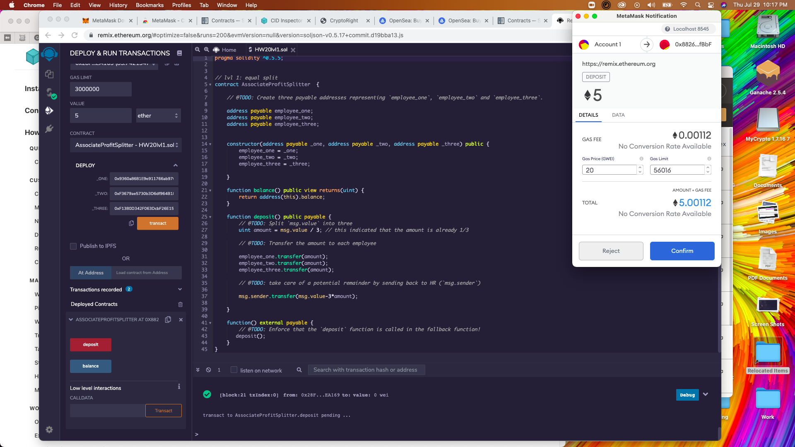
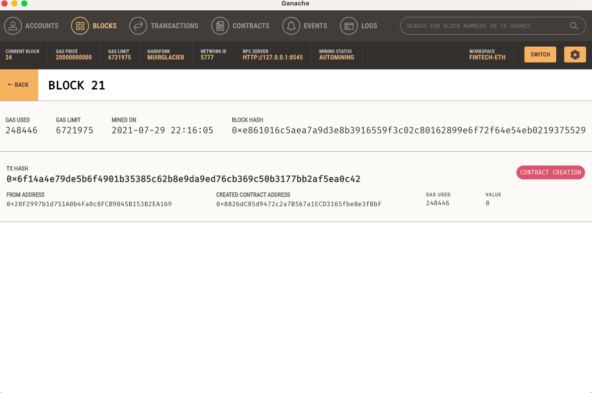
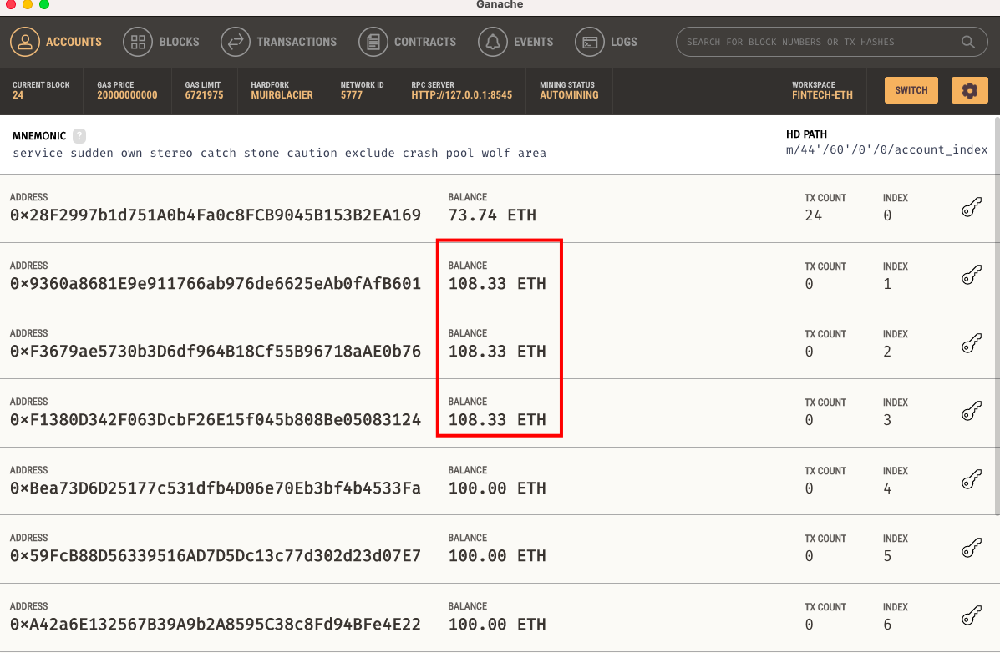
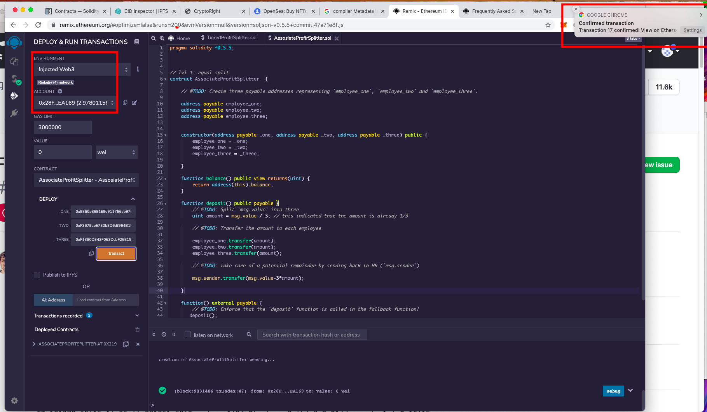
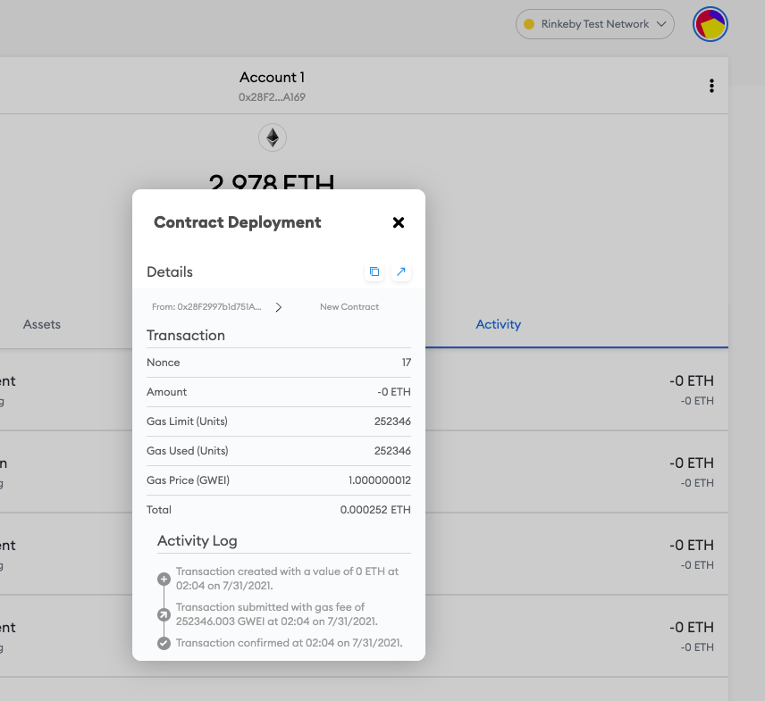

# HW 20 Smart Contracts

## Objective

Build smart contracts to automate some company finances to make everyone's lives easier, increase transparency, and to make accounting and auditing practically automatic.

**Level One** is an `AssociateProfitSplitter` contract. This will accept Ether into the contract and divide the Ether evenly among the associate level employees. This will allow the Human Resources department to pay employees quickly and efficiently.

### Contract requirements

At the top of your contract, you will need to define the following `public` variables:

* `employee_one` -- The `address` of the first employee. Make sure to set this to `payable`.

* `employee_two` -- Another `address payable` that represents the second employee.

* `employee_three` -- The third `address payable` that represents the third employee.

Create a constructor function that accepts:

* `address payable _one`

* `address payable _two`

* `address payable _three`

Within the constructor, set the employee addresses to equal the parameter values. This will allow you to avoid hardcoding the employee addresses.

Next, create the following functions:

* `balance` -- This function should be set to `public view returns(uint)`, and must return the contract's current balance. Since we should always be sending Ether to the beneficiaries, this function should always return `0`. If it does not, the `deposit` function is not handling the remainders properly and should be fixed. This will serve as a test function of sorts.

* `deposit` -- This function should set to `public payable` check, ensuring that only the owner can call the function.

  * In this function, perform the following steps:

    * Set a `uint amount` to equal `msg.value / 3;` in order to calculate the split value of the Ether.

    * Transfer the `amount` to `employee_one`.

    * Repeat the steps for `employee_two` and `employee_three`.

    * Since `uint` only contains positive whole numbers, and Solidity does not fully support float/decimals, we must deal with a potential remainder at the end of this function since `amount` will discard the remainder during division.

    * We may either have `1` or `2` wei leftover, so transfer the `msg.value - amount * 3` back to `msg.sender`. This will re-multiply the `amount` by 3, then subtract it from the `msg.value` to account for any leftover wei, and send it back to Human Resources.

* Create a fallback function using `function() external payable`, and call the `deposit` function from within it. This will ensure that the logic in `deposit` executes if Ether is sent directly to the contract. This is important to prevent Ether from being locked in the contract since we don't have a `withdraw` function in this use-case.

#### Testing the contract

Contract succesfully deployed using localhost 8545 and metamask confirmation.

Transaction block in ganache.

Testing functionallity of the contract with ETH in local network, sent 25 ETH and it got split in the 3 aacounts selected.

---
**Results**

Contract was deployes using Rinkby network.

##**Contract address: 0x219130D2a4ab80F67e1E6EBb2C991Eb836714903**
---

### Deployed contract

Contract deployed in the Rinkby network with metamask confirmation tab.

Metamask transaction record.

---

## Resources

Building the next financial revolution isn't easy, but we need your help, don't be intimidated by the semicolons!

There are lots of great resources to learn Solidity. Remember, you are helping push the very edge of this space forward,
so don't feel discouraged if you get stuck! In fact, you should be proud that you are taking on such a challenge!

For some succinct and straightforward code snips, check out [Solidity By Example](https://github.com/raineorshine/solidity-by-example)

For a more extensive list of awesome Solidity resources, checkout [Awesome Solidity](https://github.com/bkrem/awesome-solidity)

Another tutorial is available at [EthereumDev.io](https://ethereumdev.io/)

If you enjoy building games, here's an excellent tutorial called [CryptoZombies](https://cryptozombies.io/)

---
